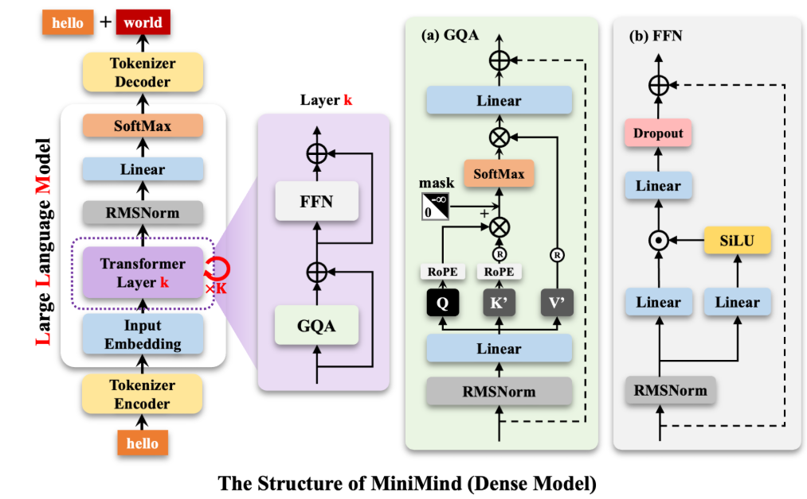
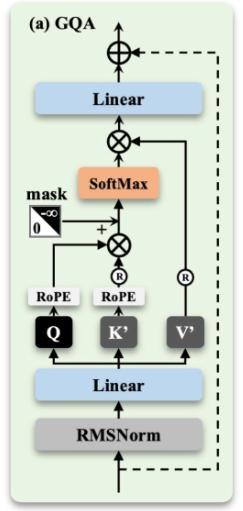
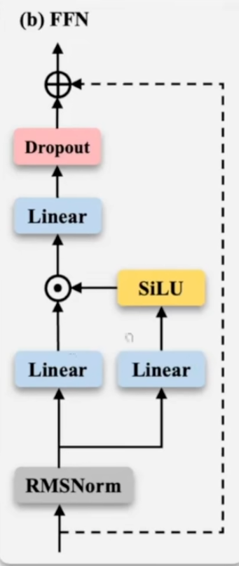
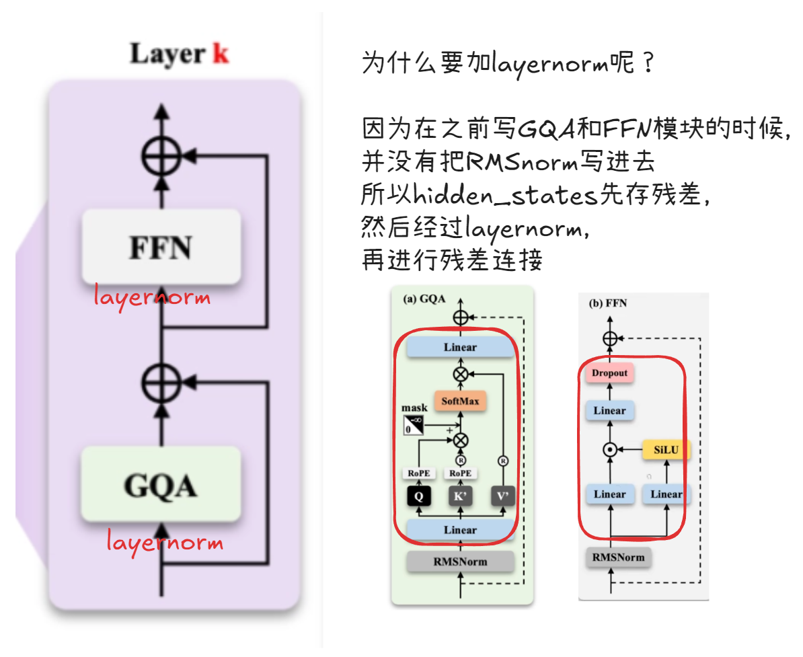
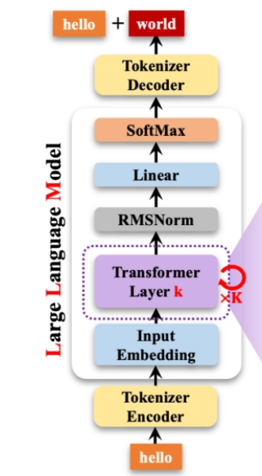

# 模型主架构

# 0.架构图



这个是dense model


这个是混合专家架构

# 1.RMSnorm

RMSnorm比传统的layernorm少了均值的计算

维度 `[bs, seqlen, d_model]` ,layernorm对第三个维度求平均

LayerNorm：对模型维度（d_model）上的均值和方差进行归一化

$$
y = \frac{x-mean[x]}{\sqrt{Var[x]+\epsilon}}*γ+bias
$$

RMSNorm：不减去均值，也不添加偏置项

$$
y = \frac{x}{\sqrt{Var[x]+\epsilon}}*γ
$$

```python
class RMSNorm(nn.Module):
    def __init__(self, hidden_size: int, eps: float = 1e-8):
        super(RMSNorm, self).__init__()
        self.varx = None
        self.eps = eps
        self.hidden_size = hidden_size
        # 再加一个初始化权重,为隐藏层的大小
        self.weight = nn.Parameter(torch.ones(hidden_size))

    def forward(self, x):
        self.varx = x.pow(2).mean(-1,keepdim=True)
        return self.weight * torch.rsqrt(self.varx + self.eps) * x
```

首先明确一个x的维度为`[batch_size, seq_len, hidden_size]`

里面的`hidden_size`就是词向量维度， 也就是特征维度

Transformer 中 RMSNorm 是对 **每个 token 的特征向量（hidden_size）** 做归一化，所以用 `mean(-1)` 对最后一维求平均。

# **2.RoPE & YaRN （position embedding）**

### 问：为什么要采用相对位置编码？

因为绝对位置编码过于呆板，我们只需要知道一个token相对于另一个token的位置即可

之前的相对位置编码是在 Attention 矩阵上直接加一个数字，这样会直接搞脏语义，而不是通过向量的“内积”自然产生的。而rope能直接将**将“位置”转化为“旋转角度”**，从而直接得出相对位置

**具体计算过程**

假设第一个词向量转$\theta$，那么第m个词向量就转$m\theta$ ，那么第n个词向量就转$n\theta$

这两个词向量的相对位置就是$(n-m)\theta$

现在要计算两者的注意力分数

$$
q' = R(m\theta)q，k' = R(n\theta)k
$$

$$
 \begin{aligned} \text{Score} &= (q')^T \cdot k' = q^T \cdot R(-m\theta) \cdot R(n\theta) \cdot k \\ &= q^T \cdot R\bigl((n - m)\theta\bigr) \cdot k \end{aligned}
$$

通过绝对位置的编码实现相对位置的记录

**上面是2维的旋转，当出现多维了怎么办？**

1. 使用分组，一个维度一个组，一个组内有自己的旋转矩阵**出现角度重叠怎么办？**
越低维转的越快，越高维转的越慢，从而避免重叠

# **3.GQA**



## 0.1 kv_repeat技术

传统多头注意力，比如16个头，就要存16份KV

这实在是太占用宝贵的显存和算力了。所以,让为个Q共享一组K和V

经工程验证, 4个Q共享一个K和v效果最好。

**问：为什么不采用比如多个K共享一个QV之类的呢?**

QKV可以想成数据库的query,key,value。kv并不重要,如何query才重要。Q是提问者,是融合上下文,获取不同词意的核心,KV只是像“数据库”一样的角色,负责提供信息

```python
def repeat_kv(x:torch.Tensor,n_rep:int) -> torch.Tensor:
    batch_size,slen,kv_heads,head_dim = x.shape
    if n_rep == 1:
        return x
    # 在第四个维度插入新的维度,变成5维的张量,然后通过reshape合并维度的方式变成4维
    return ((x[:, :, :, None, :]
            .expand(batch_size, slen, kv_heads, n_rep, head_dim))
            .reshape(batch_size,slen,kv_heads*n_rep, head_dim))
```

## 0.2 kv_cache

如果没有 KV Cache，大模型每生成一个新字，都要把前面所有的字重新计算一遍，这会导致生成速度越来越慢。

在大模型**生成（Decoding）阶段**，我们是一个字一个字往外蹦的。当你计算“月”的时候，“床前”这两个词的 K 和 V 向量其实已经算过了。如果不存起来，每次都要重新计算一遍前面的词，计算量会随文本长度呈**二次方级**增长。

KV Cache 的核心思想是：**空间换时间**。

- **缓存历史：** 把每一层已经计算好的 K（Key）和 V（Value）向量保存在**显存**里。
- **计算当前：** 每一轮推理，只计算**当前最新**那一个词的 Q, K, V。
- **拼接与合并：** 把最新的 K, V 拼接到之前的 Cache 后面，形成完整的序列。
注意，要在`seq_len`句子长度这个维度上进行拼接！

```python
# past_key_value 是之前缓存的 (K_old, V_old)
if past_key_value is not None:
    # xk, xv 是当前最新输入的词算出来的 (K_new, V_new)
    # torch.cat 在序列长度维度（dim=1）进行拼接
    xk = torch.cat([past_key_value[0], xk], dim=1)
    xv = torch.cat([past_key_value[1], xv], dim=1)

# 如果开启了 use_cache，就更新缓存，留给下一个词用
past_kv = (xk, xv) if use_cache else None
```

- **`use_cache`** 控制的是**行为**：模型，请你帮我把 KV 存好返回给我。
- **`past_key_value`** 存储的是**状态**：这是我之前存好的 KV，请你接在后面算。

**问1：为什么只有kv_cache，没有q_cache?**

答：k和v代表的是整个上文的信息，后面每一步都要用，而q只服务于当前这一步，用完就丢掉。

为什么不缓存q呢，核心原因是因为q的复用价值为0。kv就像是一门字典的全部内容，是全局共享的记忆，后面的查询q都得依赖这本字典。而q只是这一次的查询请求，是瞬时使用的查询，这次查完了，下次就不会用到了，因此不需要加到cache里面。

**问2：为什么训练时不用kv_cache**

因为训练和推理的模式完全不同，训练是看完所有答案再打分，整个序列是并行输入，可以一次性并行算出所有位置的损失。而推理是走一步看一步，必须串行生成。训练追求的是梯度传播的准确性，需要完整无损的计算图，加了cache反而会破坏计算图。

---

### 1.1 初始化：确定qv复制数、头的维度、qkv矩阵维度

`num_attention_heads (n_heads)`: 决定了 Query 的头数。

`num_key_value_heads (n_kv_heads)`: 决定了 Key 和 Value 的头数。

核心的就两个：

**kv的重复的数量 = q的头数 // kv的头数**(后面要进行kv头数的复制)

**单头的维度 = 总的词向量 `hidden_size`// 头的数量（q的头数）**

```python
self.n_local_heads = args.nums_attention_heads
self.num_key_value_heads = args.num_key_value_heads
self.n_rep = self.n_local_heads // self.num_key_value_heads
self.head_dim = args.hidden_size // self.n_local_heads

# k和v实际只有num_key_value_heads个头(回去画一下图)
self.q_proj = nn.Linear(args.hidden_size, args.n_local_heads*args.num_attention_heads, bias=False)
self.k_proj = nn.Linear(args.hidden_size, args.n_local_heads*args.num_key_value_heads, bias=False)
self.v_proj = nn.Linear(args.hidden_size, args.n_local_heads*args.num_key_value_heads, bias=False)
# 整合多头的最后mlp
self.o_proj = nn.Linear(args.hidden_size, args.hidden_size, bias=False)
```

dropout

```python
self.attn_dropout = nn.Dropout(args.dropout)
self.residual_dropout = nn.Dropout(args.dropout)
self.dropout = args.dropout
```

### 1.2 forward

```python
def forward(self,x:torch.Tensor,
            position_embeddings: Tuple[torch.Tensor,torch.Tensor],
            past_key_values: Optional[Tuple[torch.Tensor,torch.Tensor]],
            use_cache=False,
            attention_mask: Optional[torch.Tensor] = None
            ):
    # 1. qkv投影
    bsz, seq_len, _ = x.shape
    xq, xk, xv = self.q_proj(x), self.k_proj(x), self.v_proj(x)
    # 2. 用view把头数和头的维度展开
    xq = xq.view(bsz,seq_len,self.n_local_heads,self.head_dim)
    xk = xk.view(bsz,seq_len,self.num_key_value_heads,self.head_dim)
    xv = xv.view(bsz,seq_len,self.num_key_value_heads,self.head_dim)
```

因为在attention计算中，实际上要用到的是`seq_len`和`head_dim`，而之前的qkv的维度为`[bsz, seq_len, n_local_heads, head_dim]`，所以需要把第二维和第三维进行转置

```python
    # 3.rope_positional embedding
    cos, sin = position_embeddings
    xq, xk = apply_rotary_pos_emb(xq, xk, cos, sin)

    # 4.kv_cache实现以及 qkv装置和repeat
    # 先进行kvcache，在列上进行拼接
    if past_key_values is not None:
        # 取出之前进行拼接
        xk = torch.cat([past_key_values[0], xk], dim=-1)
        xv = torch.cat([past_key_values[1], xv], dim=-1)
    past_kv = (xk,xv) if use_cache else None

    # 进行第二维和第三维转置
    xq, xk, xv =(
        xq.transpose(1,2),
        repeat_kv(xk, self.n_rep).transpose(1,2),
        repeat_kv(xv, self.n_rep).transpose(1,2)
    )
```

进行attention计算阶段，先判断能否使用falsh attention

```python
if self.flash and seq_len>1 and (attention_mask is None or torch.all(attention_mask == 1)):
    output = F.scaled_dot_product_attention(xq, xk, xv, dropout_p=self.dropout if self.training else 0.0,  is_causal=True)
```

如果不能使用flash attention，就进行下面完整的attention计算的部分

### 两个掩码：因果掩码Causl Mask和填充掩码Padding Mask

- **因果掩码 / 上三角掩码 (Causal Mask)**：
    - **目的**：解决“时间穿越”问题。在自回归生成（预测下一个词）的过程中，当前位置的词只能依赖它之前的词和它自己，绝对不能“偷看”它之后的词。
    - **作用对象**：针对的是序列中的**未来位置**。
- **填充掩码 (Padding Mask / attention_mask)**：
    - **目的**：解决“批处理计算（Batching）对齐”问题。在将多条长短不一的句子拼成一个 Batch 丢给 GPU 计算时，较短的句子会被补上无意义的 `<PAD>` 符以对齐矩阵维度。模型不应该把注意力分配给这些无意义的填充符。
    - **作用对象**：针对的是序列中的**无意义填充符（Padding tokens）**。

**第一部分：因果掩码/上三角掩码**

在标准注意力计算阶段，因为是decoder only模型，所以默认都有三角掩码

```python
scores[:, :, :, -seq_len:] += torch.triu(torch.full((seq_len, seq_len), float("-inf"), device=scores.device), diagonal=1)
```

- **`torch.full(..., float("-inf"))`**：创建一个全是 -\infty 的矩阵。
- **`torch.triu(..., diagonal=1)`**：取这个矩阵的**上三角部分**（不包含主对角线）。
- **Query (Q)**: 只包含这 **3** 个新词。形状是 `[Batch, Heads, 3, Head_Dim]`
- **Key (K)**: 包含之前的 10 个词 + 现在的 3 个词。形状是 `[Batch, Heads, 13, Head_Dim]`
- **Scores (Q \times K^T)**: 得到一个形状为 `[Batch, Heads, 3, 13]` 的矩阵。
这里的seq_len是当前新词的长度，所以只要`seq_len, seq_len`这部分打上三角掩码即可

**第二部分：填充掩码**，`attention_mask` 原本是 `[Batch, SeqLen]`

```python
if attention_mask is not None:
# 从[bsz,head_dim]扩维到[bsz,:,:,head_dim]
    extended_attention_mask = attention_mask.unsqueeze(1).unsqueeze(2) # 扩维
    extended_attention_mask = (1.0 - extended_attention_mask) * -1e9   # 取反并放大
    scores = scores + extended_attention_mask                         # 叠加到得分上
```

**扩维 (`unsqueeze`)**：`attention_mask` 原本是 `[Batch, SeqLen]`，通过两次扩维变成 `[Batch, 1, 1, SeqLen]`。这样它就能利用 **广播机制 (Broadcasting)** 直接加到 4 维的 `scores` 矩阵上。

**取反与放大**：

- 通常 `attention_mask` 中，`1` 代表有效的词，`0` 代表补零的 Padding。

- `(1.0 - mask)` 把 `1` 变 `0`（有效词），把 `0` 变 `1`（Padding）。

- 乘以 `-1e9`（一个极大的负数）：有效词加了 0，值不变；**Padding 部分变成了极小的负数**(鬼之手)

**相加**：将这个“惩罚项”加到 `scores` 上，确保 Softmax 之后，这些 Padding 位置的权重几乎为零。

**第三部分：经过softmax和dropout，最后再把v乘上去**

```python
scores = F.softmax(scores.float(), dim=-1).type_as(xq)
scores = self.attn_dropout(scores)
output = scores @ xv
```

最后的最后，重回维度

```python
# 重回维度
output = output.transpose(1, 2).reshape(bsz, seq_len, -1)
output = self.residual_dropout(self.o_proj(output))
return output, past_kv
```

# **4.FFN（SwiGLU前馈网络）**



SwiGLU的数学公式为：

$SwiGLU(X) = (σ(XW₂) ⊙ XW₁)W₃$

**σ** 是SiLU激活函数，定义为 `σ(x) = x / (1 + e⁻ˣ)`

FFN层是为了升维，让特征更加的细节化

SiLU是激活函数，是为了引入非线性，从而能够拟合非线性的数据，并且能够**生成权重图，不重要的地方会变成0，重要的地方数值会变大。**

**问：中间那个带有圆点的符号 \odot 是什么操作？**

答：$\odot$ 代表 **逐元素相乘（Element-wise Product）**。这个结构被称为 **GLU（门控线性单元）** 的变体。

如果我们假设 RMSNorm 的输出为 x，那么这个 FFN 层的核心计算过程（简化版）如下：

$\text{Output} = \text{Linear}_3(\text{Linear}_1(x) \odot \text{SiLU}(\text{Linear}_2(x)))$

这种设计通过一条路径进行线性变换，另一条路径进行非线性激活（SiLU），然后相乘，起到了一种“信息过滤”或“门控”的作用。

1. **特征提取**（左侧线性层）。
2. **生成权重地图**（右侧线性层 + SiLU）。
3. **加权过滤**（逐元素相乘）。

注意softmax操作还有加上残差都是在另外一个类实现，所以当前FFN模块不需要实现这个功能。

# 5.**Transformer Layer**



处理的是这个模块。这是一个decoder-only的模型，所以只有decoder

```python
class MiniMindBlock(nn.Module):
    def __init__(self,layer_id:int,config:MiniMindConfig):
        super().__init__()
        self.num_attention_heads = config.num_attention_heads
        self.hidden_size = config.hidden_size
        self.head_dim = self.hidden_size // self.num_attention_heads
        self.self_attn = Attention(config)

        self.layer_id = layer_id
        self.input_layernorm = RMSNorm(config.hidden_size,eps=config.layer_norm_eps)
        self.post_attention_layernorm = RMSNorm(config.hidden_size,eps=config.layer_norm_eps)
        self.ffn = FeedForward(config)

    def forward(self,hidden_states:torch.Tensor,
                position_embeddings: Tuple[torch.Tensor,torch.Tensor],
                past_key_values=None,
                use_cache=None,
                attention_mask= None
                ):
        residual = hidden_states # 先存残差
        # 经过attention处理后的隐藏态和k,v
        hidden_states,present_key_values = self.self_attn(
            self.input_layernorm(hidden_states),
            position_embeddings,
            past_key_values,
            use_cache,
            attention_mask
        )
        # block的两个残差连接
        hidden_states = residual + hidden_states
        hidden_states = hidden_states + self.ffn(self.post_attention_layernorm(hidden_states))
        return hidden_states
```

# 6.**组装MiniMindModel**



注意刚开始输入Model的`input_ids`只有两维`[batch_size, seq_len]`，经过embedding才有第三维

## 初始化

```python
def __init__(self,config:MiniMindConfig):
        super().__init__()
        # hidden_layers指的是隐藏层的维度，也是有多少个transformer块
        self.vocab_size,self.num_hidden_layers,self.hidden_size=(
            config.vocab_size,
            config.num_hidden_layers,
            config.hidden_size
        )
        # input embedding
        self.embed_tokens = nn.Embedding(config.vocab_size,config.hidden_size)
        self.dropout=nn.Dropout(config.dropout)
        self.layers = nn.ModuleList(
            [MiniMindBlock(i,config) for i in range(self.num_hidden_layers)]
        )
        self.norm=RMSNorm(config.hidden_size,eps=config.rms_norm_eps)

        # rope预计算
        self.freq_cos, self.freqs_sin = precompute_freqs_cis(
            dim = config.hidden_size // config.num_attention_heads,
            end = config.max_position_embeddings,
            rope_base=config.rope_base,
            rope_scaling=config.rope_scaling,
        )

        # 缓冲区
        self.register_buffer("freqs_cos", self.freq_cos,persistent=False)
        self.register_buffer("freqs_sin", self.freqs_sin,persistent=False)
```

## forward

```python
		batch_size, seq_len = input_ids.shape # 刚开始的输入只有两维

        if hasattr(past_key_values,"layers"):
            past_key_values = None
        past_key_values = past_key_values or [None]*self.layers

        start_pos= (
            past_key_values[0][0].shape[1] if past_key_values[0] is not None else 0
        )

        hidden_states = self.dropout(self.embed_tokens(input_ids))
        position_embeddings=(
            self.freqs_cos[start_pos:start_pos+seq_len],
            self.freqs_sin[start_pos:start_pos+seq_len],
        )
```

### 经过k层MiniMind Block

里面的`past_key_value`指的是过去的kv值

这个循环先取出每一层的layer和past_key_value。由于大模型每一层的自注意力机制（Self-Attention）都有自己专属的权重和历史缓存，`zip` 函数把“第 N 层”和“第 N 层对应的历史缓存”完美地绑定在了一起。

数据正式进入当前这一层（`layer`）进行加工，并传入了必备的“原材料”：

这里的layer就是之前定义好的`MindMindBlock`[5.Transformer Layer](https://www.notion.so/5.Transformer%20Layer)

- **`hidden_states`**：你要处理的核心数据（也就是当前词的向量特征）。**注意：这个变量在循环里是在不断被更新的。** 第 1 层处理完后，变成新的 `hidden_states`，直接送给第 2 层，以此类推。
- **`position_embeddings`**：我们在外面算好的 RoPE 旋转位置编码，告诉这一层当前词在句子中的确切位置。
- **`past_key_value`**：把这一层专属的历史记忆传进去。这样模型在计算当前词时，可以直接参考历史，而**不需要把之前说过的话从头到尾再算一遍**，这极大地节省了算力。
- **`attention_mask`**：注意力掩码。比如在生成阶段，它会遮挡住“未来的词”，防止模型作弊看到还没生成的答案；在批量训练时，用来遮挡补齐用的无意义占位符（Padding）。

```python
presents = []
for layer_idx, (layer, past_key_value) in enumerate(zip(self.layers, past_key_values)):
    hidden_states, present = layer(
	    hidden_states,
	    position_embeddings,
	    past_key_value=past_key_value,
	    use_cache=use_cache,
	    attention_mask=attention_mask
	)
	presents.append(present)
```

当这一层加工完毕后，会吐出两个东西

1. **更新后的 `hidden_states`**：带着更深层语义理解的向量，它将作为下一次循环（下一层）的输入
2. **`present`**：当前层结合了历史和最新输入后，生成的**最新 KV 缓存**。
最后，`presents.append(present)` 把这一层的新缓存放进了我们一开始准备好的列表里。当所有层都循环完毕后，`presents` 里面就装满了每一层的最新记忆，准备留给生成下一个词时使用。

```python
		hidden_states = self.norm(hidden_states)
        return hidden_states,presents
```

后面的linear和softmax在causal LM中实现

# 7.**CausalLM**

把[6. 组装MiniMindModel](https://www.notion.so/6.%20%E7%BB%84%E8%A3%85MiniMindModel)理解的高级概念转化为人类看得懂的文字，并接入到当今主流的Huggingface生态

- **权重共享 (Weight Tying)**：`embed_tokens`（输入层）与 `lm_head`（输出层）共享同一个权重矩阵。这是一个显著的压缩策略，能大幅减少参数量（尤其是在词表很大时）。

```python
class MiniMindForCausalLM(PreTrainedModel, GenerationMixin):
    """
    MiniMind 因果语言模型 (Causal Language Model)

    这是面向最终任务（文本生成）的顶层封装类。

    架构组成：
        Input IDs -> [MiniMindModel] -> Hidden States -> [LM Head] -> Logits

    关键特性：
        1. 权重共享 (Weight Tying): 输入 Embedding 和输出 LM Head 共享同一份参数，显著减少显存。
        2. 推理优化 (Logits Slicing): 支持只计算最后一个 Token 的 Logits，避免全量计算。
        3. 训练并行 (Parallel Training): 利用 Mask 实现一次性计算所有 Token 的 Loss。
    """
    config_class = MiniMindConfig  # 指定配置类，Hugging Face 框架自动加载机制需要

    def __init__(self, config: MiniMindConfig = None):
        """
        初始化模型结构
        """
        # 如果没有传入 config，则实例化一个默认配置
        self.config = config or MiniMindConfig()

        # 初始化父类 PreTrainedModel (负责权重加载、保存、下载等)
        super().__init__(self.config)

        # ========== 1. 骨干网络 (Backbone) ==========
        # 实例化纯 Transformer Decoder，负责提取深层语义特征
        # 输入: [Batch, Seq_Len] -> 输出: [Batch, Seq_Len, Hidden_Size]
        self.model = MiniMindModel(self.config)

        # ========== 2. 语言模型头 (LM Head) ==========
        # 这是一个线性投影层 (Linear Layer)
        # 作用: 将高维特征向量 (Hidden State) 映射回词表空间 (Vocab Space)
        # 形状: [Hidden_Size] -> [Vocab_Size]
        # bias=False: 现代大模型 (LLaMA等) 通常不使用偏置项，以提升数值稳定性
        self.lm_head = nn.Linear(self.config.hidden_size, self.config.vocab_size, bias=False)

        # ========== 3. 权重共享 (Weight Tying) ==========
        # [重要优化] 将 Input Embedding 的权重指针指向 LM Head 的权重
        # 物理意义: 语义上，“输入一个词”和“预测一个词”使用的是同一个语义空间。
        # 显存优势: 词表通常很大 (如 64k)，权重共享能节省大量参数 (Hidden * Vocab)。
        self.model.embed_tokens.weight = self.lm_head.weight
```

**前向传播 (支持 训练 和 推理 两种模式)**

**Args:**

- **input_ids**: 输入序列 `[Batch, Seq_Len]`。
    - 训练时: 是一整句话 (`Seq_Len = N`)。
    - 推理时(Decoding): 通常只是最新生成的那个词 (`Seq_Len = 1`)。
- **attention_mask**: 掩码 `[Batch, Seq_Len]` (`1=有效`, `0=padding`)。
- **labels**: 标签序列 `[Batch, Seq_Len]`。
    - 如果提供此参数，模型会计算 Loss (训练模式)。
    - 如果为 None，只返回 Logits (推理模式)。
- **past_key_values**: KV Cache 列表。
    - 用于存储历史 Token 的 Key/Value，避免重复计算。
- **use_cache**: 是否返回更新后的 KV Cache (推理时开启)。
- **logits_to_keep**: 【性能优化参数】
    - `0` (默认): 计算所有 Token 的 Logits (训练时必须选这个)。
    - `1` (常用): 只计算最后一个 Token 的 Logits (推理生成时用)。
    - 原理: 避免在 `lm_head` 上进行无用的矩阵乘法计算。

**Returns:**

- **CausalLMOutputWithPast**: 包含 `loss`, `logits`, `hidden_states`, `past_key_values`, `aux_loss`

### 第一部分：前向传播的输入参数更新

```python
    def forward(
        self,
        input_ids: Optional[torch.Tensor] = None,
        attention_mask: Optional[torch.Tensor] = None,
        labels: Optional[torch.Tensor] = None, # 新增
        past_key_values: Optional[List[Tuple[torch.Tensor, torch.Tensor]]] = None,
        use_cache: bool = False,
        logits_to_keep: Union[int, torch.Tensor] = 0, # 新增
        **args,
    ):
```

- **解析**：这里新增了两个极其重要的参数：
    - `labels`：这是模型在**训练阶段**特有的输入。也就是标准答案（我们要模型预测的下一个词）。推理（生成对话）的时候不需要传它。
    - `logits_to_keep`：控制保留多少位置的输出，用于节省显存（之前提过的切片优化）。

### 第二部分：调用底层模型并获取输出

```python
        hidden_states, past_key_values, aux_loss = self.model(
            input_ids=input_ids,
            attention_mask=attention_mask,
            past_key_values=past_key_values,
            use_cache=use_cache,
            **args,
        )
```

- **解析**：把数据送进由几十个 Block 组成的 `MiniMindModel`。这里完美接收了三个返回值：
    1. `hidden_states`：核心语义特征。
    2. `past_key_values`：更新后的 KV Cache 记忆。
    3. `aux_loss`：混合专家（MoE）路由器的负载均衡惩罚分。(后面学)

### 第三部分：切片优化与计算 Logits

```python
        slice_indices = (
            slice(-logits_to_keep, None)
            if isinstance(logits_to_keep, int)
            else logits_to_keep
        )
        logits = self.lm_head(hidden_states[:, slice_indices, :])
```

- **解析**：
    - 这段逻辑确保了当我们仅仅想预测最后一个词时（比如大模型正在一字一字往外蹦字），不需要计算前面所有词的概率分布，极大地加速了推理。
    - `self.lm_head` 最终输出了词表中每个词的得分（`logits`）。
    logits 形状: `[Batch, Sliced_Len, Vocab_Size]`，这里是还未进行归一化的概率

### 第四部分：计算损失(仅训练模式)——错位交叉熵

因果语言模型的逻辑核心—— "Shift Prediction" (位移预测)

目标：第t个时间步的logit（得分），应该预测第t+1个时间步的Label

```
[Input]:  A  B  C  D
[Target]: B  C  D  E
```

`shift_logits`: 去掉最后一个 Logit (因为它预测的是 E，但 Input 只有到 D)，也就是预测的下一位是没用的。形状: `[Batch, Seq_Len-1, Vocab]`

`shift_labels`: 去掉第一个 Label (因为 A 之前没有 Logit 预测它。形状: `[Batch, Seq_Len-1]`

```python
        loss = None
        if labels is not None:
            shift_logits = logits[..., :-1, :].contiguous()
            shift_labels = labels[..., 1:].contiguous()
```

```python
            loss = F.cross_entropy(
                shift_logits.view(-1, shift_logits.size(-1)),
                shift_labels.view(-1),
                ignore_index=-100,
            )
```

- **解析**：计算**交叉熵损失（Cross Entropy Loss）**。
    - `.view(-1)`：把原本有批次大小（Batch Size）和句子长度的二维或三维矩阵，粗暴地拉平成一维长条，变成`[Total_Tokens, Vocab]` 以适配 Loss 函数
    - `ignore_index=-100`：这是一个极其重要的行规。在训练时，有些句子不够长，我们会用 Padding（填充符）把它补齐。但我们**不想让模型去学习预测这些无意义的填充符**。所以，我们会在外围把填充符的标签设为 `100`。PyTorch 看到 `100` 就会直接跳过，不计算这部分的误差。[1. 预训练pretrain > ^cc0349](https://www.notion.so/1.%20%E9%A2%84%E8%AE%AD%E7%BB%83pretrain#^cc0349)

### 第五部分：打包与返回

```python
        output = CausalLMOutputWithPast(
            loss=loss,
            logits=logits,
            past_key_values=past_key_values,
            hidden_states=hidden_states,
        )
        output.aux_loss = aux_loss
        return output
```

- **解析**：把算好的 `loss`（如果有的话）、生成的预测分布 `logits`、新的缓存 `past_key_values`，以及 MoE 的 `aux_loss` 全部塞进 Hugging Face 的标准输出盒子里返回。

# 8.MoE混合专家架构

## 8.1 理论基础

在传统的稠密（Dense）模型架构中，对于输入的每一个Token（词元），网络中的每一个参数都必须参与计算。这意味着计算量（FLOPs）与模型参数量呈严格的线性关系。

为了打破参数量即计算量的线性约束，混合专家（Mixture-of-Experts, MoE）架构应运而生。MoE的核心理念源于对生物神经网络的仿生学思考——人脑并非在处理每个任务时都激活所有神经元，而是根据任务类型调用特定的功能区域（如语言区、视觉区）。MoE通过**稀疏激活（Sparse Activation）和条件计算（Conditional Computation）**机制，实现了在不增加推理计算量的前提下，大幅提升模型的总参数容量（Model Capacity）。

### 8.1.1 稀疏激活**（Sparse Activation）**

在稠密的transformer中，前馈神经网络FFN层是一个全局共享的巨大矩阵，一次性要输入所有的输入数据。而在MoE架构中，这个巨大的FNN层被拆解为多个独立的子网络，记为$E_1, E_2,.. E_N$

对于任意输入向量x，MoE层的输入y不再是单一网络的映射，而是多个专家输出的加权和

$y = \sum_{i=1}^{N} G_i(x) E_i(x)$

其中，$G(x)$是门控网络（Gating Network）或路由器（Router）的输出向量，表示每个专家对当前输入 $x$ 的重要性权重。在稀疏激活策略中，为了降低计算量，我们会强制 $G(x)$  具有稀疏性，即大多数元素为0。

通常，对于每个Token，仅有 K 个专家被激活（$K \ll N$）。例如，在Mixtral 8x7B中，总专家数 $N=8$，每次激活 $K=2$ ；而在DeepSeek-V3中，总路由专家数 $N=256$，每次激活 $K=8$ 。

这种设计引入了两个关键的参数度量维度：

1. **总参数量（Total Parameters）**：模型包含的所有权重之和，决定了模型的知识库大小和表达能力的上限。
2. **激活参数量（Active Parameters）**：处理单个Token时实际参与计算的参数量，直接决定了推理的浮点运算次数（FLOPs）和延迟。

激活参数量才是真正参与FLOPs的计算，所以能够实现用小参数量推动大规模的总参数量

### 8.1.2 条件计算**（Conditional Computation）**

**条件计算是指网络根据输入数据的特性动态决定执行哪部分计算图的机制**。在MoE中，每个Token的计算路径是动态变化的。

- Token A（例如“量子力学”）可能会被路由到擅长物理知识的专家 $E_5$和 $E_{12}$。
- Token B（例如“草莓蛋糕”）可能会被路由到擅长生活常识的专家 $E_2$ 和 $E_{8}$。

可以把庞大的参数空间分为不同的“专业领域”

缺点：然而，条件计算也带来了显存管理的挑战。尽管推理时只需计算一小部分参数，但**所有参数必须加载到显存（VRAM）中**。因此，MoE模型通常是**“计算高效”但“显存饥渴”**的。这也是为何MoE技术在云端服务器上大放异彩，而在消费级显卡上部署较为困难的原因之一 。

## 8.2 基础组件详解**：从SwiGLU到投影层**

SwiGLU是专家网络的核心激活单元

### 8.2.1 SwiGLU激活函数（前面minimind的FFN层）

重点，面试常考


- 传统的ReLU/GeLU是只有一条通路。信号经过放大后，遇到激活函数，如果是正数，放行；如果是负数，拦截（置为0）。
    - 缺陷：这种“硬截断”会导致信息的永久丢失（神经元死亡），且无法根据上下文灵活调整通过的比例。
- SwiGLU 引入了 GLU（门控线性单元）[$\odot$ **逐元素相乘+linear]** 机制，将输入信号复制一份，分流到两条并行的路径上：
    - **实值路径 (Value Path)**：负责搬运实际的信息内容。
    - **门控路径**：负责计算一个 0 到 1 之间的“阀门开度”。

#### 工程上实现，神奇的**“2/3”和“3/8”系数**

SwiGLU 虽然效果好，但它有一个明显的“缺点”：**多用了一个矩阵**。

- **标准 FFN**：2 个矩阵（$W_{up}, W_{down}$）。
- **SwiGLU**：3 个矩阵（$W_{gate}, W_{up}, W_{down}$）。

如果在相同的隐藏层宽度下直接使用 SwiGLU，参数量和计算量会暴增 50%。为了在**“同等参数预算”**下进行公平对比（或者为了**节省显存**），我们需要缩减隐藏层的宽度。

结论：为了抵消多引入一个矩阵带来的成本，SwiGLU 结构的隐藏层宽度通常被设定为标准宽度的 **2/3**。

在标准 Transformer 中，隐藏层宽度 h 通常是输入维度的 4 倍（4d）。因此在 Llama 等模型中，SwiGLU 的宽度设定变为：

$$
d_{ff} \approx \frac{2}{3} \times 4d = \frac{8}{3}d
$$

这就是为什么你在查看 Llama 2 (7B) 的参数时，会发现其中间层维度是 **11008**，而不是标准的 16384 —— 因为 $11008 \approx \frac{2}{3} \times 16384$。这是一个经典的“用宽度换深度（复杂交互）”的工程决策。

#### 投影层的深度解析

从上面的SwiGLU可以知道每个MoE专家的内部，都有三个投影矩阵$W_{gate}, W_{up}, W_{down}$

- **Gate Projection ($W_g$) & Up Projection ($W_u$)**：升维3/8倍
    - 这两个矩阵负责将输入的Token向量从模型维度（$d_{model}$）映射到更高维的中间特征空间（$d_{ff}$）。
    - **Up Projection** 提供了丰富的信息内容（Value）。
    - **Gate Projection** 提供了选择信息的控制信号（Attention/Gating）。
    - 这种分离的设计允许模型独立地学习“内容”和“控制”，类似于LSTM中的门控逻辑，但在前馈网络中以并行方式实现高效计算 。
- **Down Projection ($W_d$)**：降维3/8倍
    - 该矩阵负责将高维的中间特征“压缩”回模型维度（$d_{model}$）。
    - 这一步不仅仅是降维，更是特征的融合（Aggregation）。经过门控筛选和非线性变换后的特征在这里被线性组合，形成该专家对Token的最终处理结果。
    - 在量化（Quantization）研究中发现，**Down Projection** 对数值精度极为敏感，通常不能过度量化，而**Up Projection** 相对鲁棒。DeepSeek-V3在FP8训练中可能针对这些层的统计特性做了特殊的缩放因子（Scaling Factor）设计 。

```python

class FeedForward(nn.Module):
    """
    SwiGLU 前馈网络
    
    实现了 SwiGLU (Swish-Gated Linear Unit) 激活函数的前馈网络。
    SwiGLU 是 GLU (Gated Linear Unit) 的变体，使用 Swish/SiLU 作为门控激活函数。
    
    公式：
        FFN(x) = down_proj(Swish(gate_proj(x)) * up_proj(x))
    
    其中：
        - gate_proj: 门控投影，用于生成门控信号
        - up_proj: 上投影，用于生成特征
        - Swish(x) = x * sigmoid(x) = x * silu(x)
        - down_proj: 下投影，将中间维度映射回 hidden_size
    
    相比标准 FFN (ReLU(xW1)W2)，SwiGLU 通常有更好的性能。
    """
    def __init__(self, config: MiniMindConfig):
        """
        初始化前馈网络
        
        Args:
            config: MiniMindConfig 配置对象
        """
        super().__init__()
        # ========== 中间层维度计算 ==========
        # 如果未指定 intermediate_size，则自动计算
        if config.intermediate_size is None:
            # 标准比例：intermediate_size = hidden_size * 8/3
            #   例如：hidden_size=512 -> intermediate_size ≈ 1365
            intermediate_size = int(config.hidden_size * 8 / 3)
            # 向上取整到 64 的倍数（优化 GPU 计算效率）
            #   例如：1365 -> 1408 (64 * 22)
            config.intermediate_size = 64 * ((intermediate_size + 64 - 1) // 64)
        
        # ========== 投影层 ==========
        # gate_proj: 门控投影，hidden_size -> intermediate_size
        self.gate_proj = nn.Linear(config.hidden_size, config.intermediate_size, bias=False)
        # down_proj: 下投影，intermediate_size -> hidden_size
        self.down_proj = nn.Linear(config.intermediate_size, config.hidden_size, bias=False)
        # up_proj: 上投影，hidden_size -> intermediate_size
        self.up_proj = nn.Linear(config.hidden_size, config.intermediate_size, bias=False)
        
        # ========== Dropout 和激活函数 ==========
        self.dropout = nn.Dropout(config.dropout)
        # 激活函数：通常是 'silu' (Swish)
        self.act_fn = ACT2FN[config.hidden_act]

    def forward(self, x):
        """
        前向传播
        
        SwiGLU 公式：FFN(x) = down_proj(Swish(gate_proj(x)) * up_proj(x))
        
        Args:
            x: 输入张量 [batch, seq_len, hidden_size]
            
        Returns:
            输出张量 [batch, seq_len, hidden_size]
        """
        # 计算门控信号和特征
        gate = self.gate_proj(x)  # [batch, seq_len, intermediate_size]
        up = self.up_proj(x)  # [batch, seq_len, intermediate_size]
        
        # SwiGLU：Swish(gate) * up
        #   Swish(x) = x * sigmoid(x) = silu(x)
        activated = self.act_fn(gate) * up  # [batch, seq_len, intermediate_size]
        
        # 下投影回 hidden_size 并应用 dropout
        return self.dropout(self.down_proj(activated))  # [batch, seq_len, hidden_size]

```

### 8.2.2 DeepSeekMoE：细粒度专家与知识解耦

DeepSeek系列模型（V2/V3）提出了一种革命性的MoE架构，旨在解决传统MoE（如GShard, Switch Transformer）面临的两个核心问题：**专家粒度过粗**导致的知识混合，以及**路由坍缩**导致的参数冗余。

#### 细粒度专家分割**（Fine-Grained Expert Segmentation）**

传统的MoE的专家数量较少（如8个），并且每个专家的参数量巨大。**Deepseek认为这样粗粒度的划分的专家难以实现真正的专业化**

Deepseek采用了细粒度专家分割策略：

- **DeepSeek-V2**：每层包含160个路由专家，每次激活6个，每个专家的中间维度仅为1536 。
- **DeepSeek-V3**：每层包含256个路由专家，每次激活8个，专家维度进一步细化 。

通过将大专家“切碎”为许多小专家，模型可以更灵活地组合这些小专家来应对复杂的Token。例如，处理“深度学习代码”时，可以激活“数学专家”、“Python语法专家”和“张量运算专家”的组合。这种组合爆炸带来的表达能力远超由于粗粒度专家带来的固定组合 。

#### 共享专家（最显著的创新，知识解耦）

在传统MoE中，所有的专家都是通过路由竞争被激活的。这导致了一个问题：所有的专家都必须独立学习一些基础的、通用的语言知识（如“the”是定冠词，句号表示结束）。这种**公共知识（Common Knowledge）**在多个专家中被重复存储，造成了巨大的参数冗余。

DeepSeek将一部分专家固定为“共享专家”，它们**总是被激活**，不参与路由竞争。

- **DeepSeek-V2**：设置2个共享专家 + 160个路由专家 。
- **DeepSeek-V3**：设置1个容量更大的共享专家 + 256个路由专家 。

#### 合二为一数学表达

MoE层的输出变为共享专家输出与路由专家输出之和：

$$
y = \sum_{i \in A_{shared}} E_i(x) + \sum_{j \in TopK(G(x))} g_j E_j(x)
$$

其中 $A_{shared}$ 是共享专家的集合。共享专家负责捕获**“公共知识”**，而路由专家则被解放出来，专注于捕获**“长尾知识”或“特定领域知识”**。

这种**知识解耦（Knowledge Decoupling）**策略使得DeepSeek模型在参数效率上远超同类模型，能够以更少的激活参数达到更高的智能水平 。

#### 代码实现`MoEFeedForward`

这段 `MOEFeedForward` 的核心逻辑，其实就是把普通的一个 FFN，改成了“**多个 FFN 专家 + 一个门控路由器**”。不是每个 token 都走同一个前馈层，而是先让 `gate` 给每个 token 选出最合适的若干个专家，再把这些专家的输出按权重加起来；此外还可以再叠加一组“共享专家”，让所有 token 都额外过一遍通用 FFN


```python
class MOEFeedForward(nn.Module):
    """
    MoE (Mixture of Experts) 前馈网络
    
    使用多个专家（FeedForward）处理不同的 token，通过门控网络动态选择专家。
    支持路由专家（routed experts）和共享专家（shared experts）两种类型。
    
    工作流程：
        1. 门控网络为每个 token 选择 top-k 个路由专家
        2. 每个 token 被路由到选中的专家处理
        3. 专家输出按权重加权求和
        4. 共享专家处理所有 token 并添加到输出
    """
    def __init__(self, config: MiniMindConfig):
        """
        初始化 MoE 前馈网络
        
        Args:
            config: MiniMindConfig 配置对象
        """
        super().__init__()
        self.config = config
        
        # ========== 路由专家 ==========
        # 路由专家：通过门控网络动态选择，每个 token 只使用 top-k 个专家
        self.experts = nn.ModuleList([
            FeedForward(config)
            for _ in range(config.n_routed_experts)
        ])
        
        # ========== 门控网络 ==========
        # 负责为每个 token 选择专家并计算权重，具体的实现在下一节
        self.gate = MoEGate(config)
        
        # ========== 共享专家 ==========
        # 共享专家：处理所有 token，不经过门控网络
        #   用于提供通用特征，增强模型表达能力
        if config.n_shared_experts > 0:
            self.shared_experts = nn.ModuleList([
                FeedForward(config)
                for _ in range(config.n_shared_experts)
            ])
```

#### forward函数

输入 `x` 的形状是 `[batch, seq_len, hidden_size]`。

整个前向传播可以概括成：

**门控选专家 → 路由到专家 → 加权合并 → 再加共享专家输出**。

```python
def forward(self, x):
        """
        前向传播
        
        Args:
            x: 输入张量 [batch, seq_len, hidden_size]
            
        Returns:
            输出张量 [batch, seq_len, hidden_size]
        """
        identity = x  # 保存原始输入，用于共享专家
        orig_shape = x.shape
        bsz, seq_len, _ = x.shape
        
        # ========== 步骤 1：门控网络选择专家 ==========
        # 为每个 token 选择 top-k 个专家并计算权重
        topk_idx, topk_weight, aux_loss = self.gate(x)
        # topk_idx: [batch*seq_len, top_k] - 专家索引
        # topk_weight: [batch*seq_len, top_k] - 专家权重
        
        # ========== 步骤 2：路由到专家处理 ==========
        x = x.view(-1, x.shape[-1])  # [batch*seq_len, hidden_size]
        flat_topk_idx = topk_idx.view(-1)  # [batch*seq_len*top_k] - 展平的专家索引
```

**步骤一：门控网络先给每个 token 选专家**

在这段代码中

```python
topk_idx, topk_weight, aux_loss = self.gate(x)
```

它返回三个东西：

- `topk_idx`：每个 token 选中了哪些专家
- `topk_weight`：这些被选中专家各自的权重
- `aux_loss`：辅助损失，代码里先存起来，供外部训练时使用。

注释里已经给了形状：

- `topk_idx`: `[batch*seq_len, top_k]`
- `topk_weight`: `[batch*seq_len, top_k]`

也就是说，代码把**每个 token 单独看待**，不再按 batch 和 seq 分开看。比如一共有 2×4=8 个 token，`top_k=2`，那每个 token 都会拿到 2 个专家编号和 2 个对应权重。

**步骤二：把 token 展平，并准备路由**

接着这两句：

```
x=x.view(-1,x.shape[-1])
flat_topk_idx=topk_idx.view(-1)
```

含义是：

- `x` 从 `[B, T, H]` 变成 `[B*T, H]`
- `topk_idx` 从 `[B*T, top_k]` 变成一维 `[B*T*top_k]`

为什么要这样做？因为后面要按“专家编号”把 token 分给不同专家处理，展平以后更容易做 mask、排序和索引。

```python

        if self.training:
            # 训练模式：为每个 token 的每个选中专家复制输入
            #   例如：top_k=2，每个 token 需要处理 2 次
            x = x.repeat_interleave(self.config.num_experts_per_tok, dim=0)
            # x: [batch*seq_len*top_k, hidden_size]
            
            y = torch.empty_like(x, dtype=x.dtype)
            
            # 对每个专家，处理分配给它的 token
            for i, expert in enumerate(self.experts):
                # 找到分配给专家 i 的 token 索引
                mask = flat_topk_idx == i
                expert_out = expert(x[mask])
                
                if expert_out.shape[0] > 0:
                    # 如果有 token 分配给该专家，保存输出
                    y[mask] = expert_out.to(y.dtype)
                else:
                    # 如果没有 token 分配给该专家，创建空输出（保持梯度流）
                    y[mask] = expert_out.to(y.dtype) + 0 * sum(p.sum() for p in expert.parameters())
            
            # 按权重加权求和：每个 token 的 top-k 个专家输出加权平均
            y = (y.view(*topk_weight.shape, -1) * topk_weight.unsqueeze(-1)).sum(dim=1)
            # y: [batch*seq_len, hidden_size]
            y = y.view(*orig_shape)  # [batch, seq_len, hidden_size]
        else:
            # 推理模式：使用优化的推理函数
            y = self.moe_infer(x, flat_topk_idx, topk_weight.view(-1, 1)).view(*orig_shape)
        
        # ========== 步骤 3：添加共享专家输出 ==========
        # 共享专家处理所有 token，输出直接添加到结果中
        if self.config.n_shared_experts > 0:
            for expert in self.shared_experts:
                y = y + expert(identity)  # 残差连接
        
        # 保存辅助损失供后续使用
        self.aux_loss = aux_loss
        return y

    @torch.no_grad()
    def moe_infer(self, x, flat_expert_indices, flat_expert_weights):
        """
        优化的 MoE 推理函数（仅推理时使用）
        
        通过批量处理每个专家的所有 token，减少计算开销。
        工作流程：
            1. 按专家索引排序 token
            2. 统计每个专家处理的 token 数量
            3. 批量处理每个专家的所有 token
            4. 按权重加权并累加到输出缓存
        
        Args:
            x: 输入张量 [batch*seq_len, hidden_size]
            flat_expert_indices: 展平的专家索引 [batch*seq_len*top_k]
            flat_expert_weights: 展平的专家权重 [batch*seq_len*top_k, 1]
            
        Returns:
            输出张量 [batch*seq_len, hidden_size]
        """
        expert_cache = torch.zeros_like(x)  # 输出缓存
        
        # ========== 步骤 1：按专家索引排序 ==========
        # 将 token 按专家索引排序，使同一专家的 token 聚集在一起
        idxs = flat_expert_indices.argsort()  # 排序后的索引
        
        # ========== 步骤 2：统计每个专家处理的 token 数量 ==========
        # bincount: 统计每个专家被选中的次数
        # cumsum: 累积和，得到每个专家的 token 范围
        #   例如：[6, 15, 20, 26] 表示：
        #     - 专家 0 处理前 6 个 token
        #     - 专家 1 处理第 6-15 个 token
        #     - 专家 2 处理第 15-20 个 token
        #     - 专家 3 处理第 20-26 个 token
        tokens_per_expert = flat_expert_indices.bincount().cpu().numpy().cumsum(0)
        
        # 计算每个 token 的原始索引（去除 top_k 的重复）
        token_idxs = idxs // self.config.num_experts_per_tok
        
        # ========== 步骤 3：批量处理每个专家 ==========
        for i, end_idx in enumerate(tokens_per_expert):
            start_idx = 0 if i == 0 else tokens_per_expert[i - 1]
            
            # 如果该专家没有处理的 token，跳过
            if start_idx == end_idx:
                continue
            
            # 获取该专家处理的 token 索引
            expert = self.experts[i]
            exp_token_idx = token_idxs[start_idx:end_idx]  # 原始 token 索引
            expert_tokens = x[exp_token_idx]  # 该专家需要处理的 token
            
            # 批量处理该专家的所有 token
            expert_out = expert(expert_tokens).to(expert_cache.dtype)
            
            # 应用权重
            expert_out.mul_(flat_expert_weights[idxs[start_idx:end_idx]])
            
            # 累加到输出缓存（使用 scatter_add 处理同一 token 被多个专家处理的情况）
            expert_cache.scatter_add_(
                0,
                exp_token_idx.view(-1, 1).repeat(1, x.shape[-1]),
                expert_out
            )

        return expert_cache
```

为什么训练代码和推理代码的形式不同？

| **特性** | **训练代码 (Training)** | **推理代码 (Inference)** |
| --- | --- | --- |
| **首要目标** | 梯度流正确、分布式训练稳定 | 延迟最低、吞吐量最高 |
| **Top-K 处理** | `repeat_interleave` (复制数据) | `argsort` (重排索引) |
| **空专家处理** | 必须计算 "0 * params" 防止 DDP 死锁 | 直接 `continue` 跳过 (加速) |
| **循环逻辑** | 遍历**所有**专家 | 仅处理**有负载**的专家 |
| **结果聚合** | 显式索引赋值 | `scatter_add_` (原子累加) |
| **适用场景** | 大 Batch，需要反向传播 | 小 Batch (如 Decoding=1)，只前向 |

**一句话总结：**

训练代码是为了**让 PyTorch 的自动求导引擎满意**并兼容分布式训练；推理代码是为了**让 GPU 的硬件利用率最高**并跳过无用计算。

### 8.2.3 Top-k路由机制

#### 8.2.3.1 前向传播流程

最经典的路由机制是基于Softmax的Top-K Gating。对于输入向量x和一组可学习的路由权重矩阵$W_r \in \mathbb{R}^{d_{model} \times N}$

1. 计算亲和度分数**（Affinity Scores）**：
$h(x) = x \cdot W_r$

这里 $h(x)$ 是一个 N 维向量，表示输入 x 与每个专家的匹配程度。

1. Top-k截断
    
    为了保持稀疏性，**我们只保留分数最高的 K 个值**，其余置为负无穷（$-\infty$）：
    
    $\text{KeepTopK}(h(x), K)_i = \begin{cases} h(x)_i & \text{if } h(x)_i \in \text{Top-}K(h(x)) \\ -\infty & \text{otherwise} \end{cases}$
    
2. softmax归一化
    
    $G(x) = \text{Softmax}(\text{KeepTopK}(h(x), K))$
    
3. 加权求和
    
    $y = \sum_{i \in \text{Top-}K} G(x)_i E_i(x)$
    

#### 8.2.3.2 负载均衡与辅助损失函数

**专家坍塌问题：（专家越吃越大）**

在朴素的Top-K路由中，存在一个著名的“赢家通吃”（Winner-Take-All）现象。初始化时，某些专家可能因随机噪声获得稍高的权重，导致更多数据被路由给它。该专家因此获得更多梯度更新，变得更强，进而吸引更多数据。最终，少数几个专家处理了所有数据，而其余专家处于“死亡”状态（Dead Experts），模型退化为一个小型的稠密模型，浪费了大量参数容量 。

**传统辅助损失**

为了解决负载不均，传统MoE（如GShard, Switch, Mixtral）引入了负载均衡辅助损失。

定义 fi为一批数据中路由给专家 i 的Token比例（利用率），Pi 为路由器预测给专家 i的平均概率。

$L_{aux} = \alpha \cdot N \sum_{i=1}^{N} f_i \cdot P_i$

这个损失函数强制要求 $f_i$和 $P_i$ 接近均匀分布（即每个专家处理 $\frac{1}{N}$ 的数据）。这虽然解决了坍缩问题，但也带来了副作用：**模型被迫为了“均衡”而将Token路由给次优的专家**，这种刚性约束损害了模型的主任务性能 。

#### **DeepSeek的创新：无辅助损失负载均衡（Auxiliary-Loss-Free）**

### 5.3.1 动态偏置（Bias）调整机制

DeepSeek不再将负载均衡项加入Loss函数进行梯度下降，而是直接在路由器的**Logits**上增加一个独立的偏置项 $b_i$：

$\text{Score}_i = x \cdot W_{r,i} + b_i$

这个 $b_i$ **不参与梯度下降**，而是通过一种类似PID控制的机制动态更新：

- 在每个训练Step结束时，统计每个专家 $i$ 的实际负载 $Load_i$。
- 如果 $Load_i > \text{Target Load}$（专家过载），则减少 $b_i$：$b_i \leftarrow b_i - \gamma$。
- 如果 $Load_i < \text{Target Load}$（专家空闲），则增加 $b_i$：$b_i \leftarrow b_i + \gamma$。

### 5.3.2 机制优势

这种方法的精妙之处在于**解耦**：

1. **权重 $W_r$** 仅由主任务（Cross-Entropy Loss）优化，负责学习“哪个专家最适合处理这个Token”。
2. **偏置 $b_i$** 仅由负载情况调整，负责“交通管制”。

由于Aux Loss被移除，梯度的方向不再受制于人为的均衡目标，模型可以自由地探索最优的路由策略。实验证明，这种策略不仅保证了极佳的负载均衡（即使在256个专家的情况下），还显著提升了模型性能，是DeepSeek-V3能够以较小激活参数取得SOTA性能的关键因素之一 。